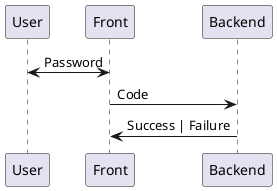
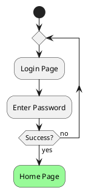

## Authentication

```plantuml
@startuml Authentication Request
User <-> Front:Password
Front -> Backend:Code
Backend -> Front: Success | Failure
@enduml
```

## Login process

```plantuml
@startuml
start
repeat
:Login Page;
:Enter Password;
repeat while (Success?) is (no) not (yes)
#palegreen:Home Page;
@enduml
```
